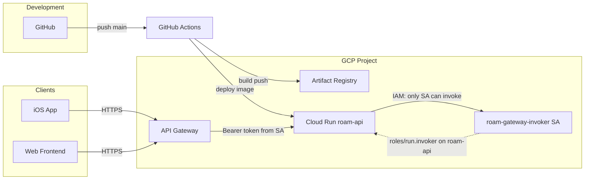

# Roam Backend Infrastructure Architecture

This document describes the production infrastructure for the Roam API and how to set it up independently. The backend runs on Google Cloud; deployment is automated via GitHub Actions.

---

## High-level flow

- **GitHub Actions** builds the backend image, pushes to **Artifact Registry**, and deploys to **Cloud Run** (`roam-api`).
- **Cloud Run** is configured with **Require authentication** (IAM only), so only identities with **Cloud Run Invoker** can call it. Columbia's organization policy forbids making this service public, so we use an API Gateway as a hack to proxy traffic to into Cloud Run.
- **API Gateway** is the public entry point: it accepts unauthenticated HTTPS from clients, then calls **Cloud Run** using a **service account** (`roam-gateway-invoker`) that has **Cloud Run Invoker**. Clients use the gateway URL as the API base; the gateway forwards paths and (where applicable) headers to the backend.

---

## 1. Cloud Run (roam-api)

### What it is

The Roam API is a **FastAPI** app running on **Cloud Run** as the service `roam-api`. Cloud Run runs the container on a fully managed platform (scaling, HTTPS, no server or TLS management).

### Why IAM is required

CUIT enforces the policy `**constraints/run.managed.requireInvokerIam`**: so every Cloud Run service must have the IAM invoker check enabled. You cannot set **Allow unauthenticated invocations** or grant `allUsers` the invoker role. So `roam-api` is deployed with **Require authentication** and only callers with the **Cloud Run Invoker** role (e.g. the API Gateway’s service account) can reach it.

### Configuration

- **Service name:** `roam-api`
- **Region:** `us-east1` (must match the region used in the workflow and Artifact Registry).
- **Authentication:** **Require authentication** — Identity and Access Management (IAM). Do not use Identity-Aware Proxy (IAP) for this service.
- **Image:** Supplied by CI from Artifact Registry, e.g. `us-east1-docker.pkg.dev/PROJECT_ID/roam/backend:SHA`.
- **Environment variables:** Set in the Cloud Run console (Variables & secrets). Required: `ENVIRONMENT=prod`, `DATABASE_URL`, `OPENAI_API_KEY`, Firebase vars (`FIREBASE_PROJECT_ID`, `FIREBASE_PRIVATE_KEY_ID`, `FIREBASE_PRIVATE_KEY`, `FIREBASE_CLIENT_EMAIL`). Optional: `CORS_ORIGINS` or `FRONTEND_ORIGIN`, `GOOGLE_MAPS_API_KEY`, `TRUSTED_AUTH_PROVIDERS`. See `docs/ENV.md` for the full list.

### Independent setup

1. Enable **Cloud Run API** (and **Cloud Run Admin API** if listed separately).
2. Create the service (or let the first CI deploy create it). If you create it manually: **Cloud Run** → **Create service** → set **Require authentication** and IAM; do **not** allow unauthenticated invocations.
3. Configure all required and optional env vars in **Edit & deploy new revision** → **Variables & secrets**.
4. Ensure the image is available in Artifact Registry (see below) and deploy a revision pointing at that image, or run the GitHub Actions workflow to deploy.

---

## 2. GitHub Actions (CI/CD)

### What it is

A single workflow builds the backend Docker image, pushes it to Artifact Registry, and deploys it to Cloud Run. It runs on every push to `main` that touches `backend/` or the workflow file.

### Workflow file

- **Path:** `.github/workflows/`*
- **Trigger:** `push` to branch `main`, paths `backend/`** or `.github/workflows/deploy-backend.yml`
- **Region:** `us-east1` (env `REGION`)

### Steps (summary)

1. **Checkout** the repository.
2. **Authenticate to GCP** using the Github secret `GCP_SA_KEY` (service account JSON key).
3. **Set up Cloud SDK** (`google-github-actions/setup-gcloud`).
4. **Configure Docker** for Artifact Registry (`gcloud auth configure-docker us-east1-docker.pkg.dev`).
5. **Build** the image from `backend/Dockerfile` with build context `backend/`. Tag with commit SHA and `latest`.
6. **Push** the image to `us-east1-docker.pkg.dev/PROJECT_ID/roam/backend:SHA` and `:latest`.
7. **Deploy** to Cloud Run: `gcloud run deploy roam-api` with the new image. The workflow may include `--allow-unauthenticated` in the file; if the org policy blocks it, the deploy will fail for that flag — the service must remain **Require authentication**, and API Gateway is used for public access instead.

### Service account for CI

Create a service account (e.g. `github-actions-deploy`) in the same project and grant:

- **Artifact Registry Writer** — so the workflow can push images.
- **Cloud Run Admin** — so the workflow can deploy and update `roam-api`.
- **Service Account User** — if the Cloud Run service runs as another identity.

---

## 3. Artifact Registry

### What it is

**Artifact Registry** holds the Docker images for the Roam API. The workflow builds the image from `backend/Dockerfile`, tags it with the commit SHA and `latest`, and pushes it here. Cloud Run pulls the image from this registry when deploying.

### Repository layout

- **Repository name:** `roam`
- **Format:** Docker
- **Location:** Region `us-east1` (same as Cloud Run and the workflow).
- **Images:**
  - `roam/backend:SHA` — backend API (FastAPI), used by Cloud Run `roam-api`.
  - `roam/backend:latest` — same image, latest tag.

Full image path example: `us-east1-docker.pkg.dev/PROJECT_ID/roam/backend:abc1234`.

### Independent setup

1. Enable **Artifact Registry API**.
2. **Artifact Registry** → **Repositories** → **Create repository**.
3. **Name:** `roam`, **Format:** Docker, **Mode:** Standard, **Location type:** Region → **us-east1**.
4. Create the repository. No need to create the `backend` image manually; the workflow creates it on first push.

---

## 4. API Gateway

### Why it exists

The organization policy `**constraints/run.managed.requireInvokerIam`** requires that **every** Cloud Run service have the IAM invoker check enabled. That means:

- You cannot set **Allow unauthenticated invocations** on Cloud Run.
- You cannot grant the **Cloud Run Invoker** role to `allUsers`.

So the Roam API (`roam-api`) cannot be made public directly. **API Gateway** is a separate GCP product that is **not** subject to this Cloud Run–specific constraint. The gateway can be reached over HTTPS by anyone (public). We configure the gateway so that when it receives a request, it calls the **Cloud Run** backend using a **service account** that has **Cloud Run Invoker** on `roam-api`. To Cloud Run, the request is authenticated (from that service account); to the client, the gateway is just a public API URL. This is the “hack” to get a public API while still satisfying Columbia’s requirement that Cloud Run use **Require authentication** and IAM for service-to-service communication.

### How it works

1. **Client** (iOS app, web) sends an HTTPS request to the **API Gateway** URL (e.g. `https://roam-gateway-xxxxx.ue.gateway.dev/health` or `https://.../api/...`).
2. **API Gateway** receives the request. It does not require the caller to have a GCP identity; the gateway is publicly reachable.
3. **API Gateway** forwards the request to the **Cloud Run** service URL (`roam-api`). When doing so, it authenticates to Cloud Run by attaching an **identity token** for a **service account** that has the **Cloud Run Invoker** role on `roam-api`. Cloud Run therefore accepts the request.
4. **Cloud Run** runs the FastAPI app. The app may receive the original request headers from the gateway (depending on API Gateway behavior). Application-level auth (e.g. Firebase ID tokens) is handled by the backend if the client sends the token (e.g. in `Authorization`) and the gateway forwards it.
5. The response from Cloud Run is returned by the gateway to the client.

So the **public** surface is the API Gateway; Cloud Run stays **private** (IAM-only) and only the gateway’s service account is allowed to invoke it.

### Components

- **API** (API Gateway resource): Logical API, e.g. `roam-api-gateway`.
- **API config**: An immutable snapshot of the API definition (OpenAPI spec). It specifies the backend URL (Cloud Run), path translation, and which service account the gateway uses to call the backend (**backend-auth-service-account**).
- **Gateway**: A deployed instance of an API config in a region. It gets a public hostname like `roam-gateway-xxxxx.ue.gateway.dev`. Traffic to that hostname is routed according to the API config to the Cloud Run backend.
- **Service account** (`roam-gateway-invoker`): Has **Cloud Run Invoker** on the `roam-api` service. The API config references this SA so the gateway uses it when calling Cloud Run.

### Client usage

- **Base URL:** Use the gateway URL as the API base (e.g. `https://roam-gateway-xxxxx.ue.gateway.dev`).
- **Paths:** Same as the backend (e.g. `/health`, `/api/users`, `/api/ingest`). The gateway appends the path to the Cloud Run URL.
- **Headers:** Send the Firebase ID token in `Authorization: Bearer <token>` for protected routes. Whether the backend receives it depends on API Gateway’s header forwarding; if the gateway overwrites `Authorization` with its own token, the backend may need to be configured to read the client token from another header (e.g. `X-Forwarded-Authorization`) if the gateway can be configured to pass it through.

