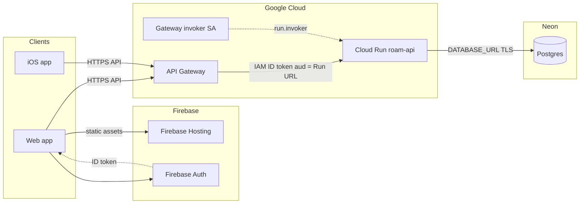

# Roam production architecture

How the live system is shaped: clients, Firebase Hosting, API Gateway, Cloud Run, and **Neon** (managed Postgres). The diagram below is **runtime / request flow** only. For the **database entity-relationship diagram** (tables, FKs, enums), see **[ERD.md](ERD.md)**. For **OpenAPI → TypeScript** typing on the web app, see **[OPENAPI.md](OPENAPI.md)**.

For **CI/CD, Artifact Registry, and GitHub Secrets**, see [DEPLOYMENT.md](DEPLOYMENT.md). For **auth middleware, verification policy, and rate limits** inside FastAPI, see [AUTH_MIDDLEWARE.md](AUTH_MIDDLEWARE.md).

---

## High-level flow

- **Web:** The React/Vite app is built as a static site and served by **Firebase Hosting** (e.g. `*.web.app`). The browser talks to **Firebase Auth** for sign-in and to the **API Gateway URL** for the Roam API.
- **API:** Clients use the **gateway** hostname as `VITE_API_BASE_URL` / iOS base URL. The gateway forwards to **Cloud Run** (`roam-api`).
- **Cloud Run** runs the FastAPI container with **Require authentication (IAM)**. Only callers with **Cloud Run Invoker**—here, the gateway’s **service account**—can invoke the service directly. The API connects to **Neon Postgres** using **`DATABASE_URL`** (see [Data: Neon Postgres](#data-neon-postgres)).

---

## Frontend (Firebase Hosting)

The web UI lives in `frontend/`, is produced by **Vite** (`npm run build`), and is deployed to **Firebase Hosting**. Hosting serves **static files** only: there is no server process that can inject per-request configuration. API base URL, Firebase web config, and other `import.meta.env.VITE_*` values are **fixed at build time**. CI injects them via **GitHub Actions secrets** (see [DEPLOYMENT.md](DEPLOYMENT.md)).

Firebase **Authentication** (email/password, Google, etc.) runs in the client; the backend trusts **Firebase ID tokens** verified with the Firebase Admin SDK.

---

## Cloud Run (`roam-api`)

The Roam **API** is a **FastAPI** app in a container on **Cloud Run**, service name `roam-api`, region **`us-east1`**.

**IAM:** The service requires **Cloud Run Invoker**. Under **CUIT** policy, it cannot be the **public** API surface; clients use the **gateway** hostname, not the raw Run URL.

**Runtime configuration** (database URL, Firebase Admin credentials, API keys, CORS origins, etc.) is supplied as **environment variables and secrets** on the Cloud Run revision. See `docs/ENV.md` for the full list.

---

## Data: Neon Postgres

**Neon** hosts the **PostgreSQL** database for Roam. It runs **outside** Google Cloud: Cloud Run connects over the network (TLS) using **`DATABASE_URL`**, stored as a secret on the Cloud Run service—not baked into the container image.

The FastAPI app uses **SQLModel** with a SQLAlchemy engine; table definitions and the canonical DDL live in `backend/` and `sql/schema.sql`. Neon provides branching, serverless scaling, and backups per your Neon project settings.

**Data model diagram:** [ERD.md](ERD.md) (Mermaid `erDiagram` + FK / enum tables). OpenAPI DTOs describe the **HTTP** contract; the ERD describes **persistence**.

---

## Why Cloud Run instead of Vercel?

Roam is meant to grow into **reel ingestion** and an **LLM pipeline**—work that behaves like **async jobs**, not a single quick request/response.

The natural API shape is: accept a job (**HTTP 202 Accepted**), return immediately, and let **web and mobile clients poll** (or subscribe later) for status while processing continues. That keeps the UI responsive instead of blocking on model and I/O.

**Vercel’s default serverless model** is built around **short-lived functions**: after the HTTP response is sent, the execution environment is **torn down**. You do not get a durable process that keeps running “in the background” for the same invocation. That leaves awkward choices:

- Hold the connection open until the LLM pipeline finishes → **long request times** and a **frozen client** (poor UX), or
- Bolt on **external** queues, cron, or other workarounds to approximate background work—**fighting the platform** rather than aligning with it.

**Cloud Run** runs a **container** that can **stay alive beyond a single HTTP response** (within configured request concurrency, timeouts, and scaling). That matches **job-style** flows: accept work, respond with 202, and continue processing inside the same service (or hand off to explicit workers) without pretending the whole pipeline fits one serverless function lifetime. For Roam’s direction, that is a better fit than Vercel’s request-scoped execution model. Adding dependencies like queues or whatever else will make the whole system harder to stablize than just putting in more upfront energy into building GCP infra

---

## API Gateway

**Why it exists — Columbia University IT (CUIT):** **CUIT** restricts exposing a **GCP Cloud Run** service to the **public internet without IAM** (organization constraints such as `run.managed.requireInvokerIam` require the invoker check; public `allUsers` access is not allowed as your API entrypoint). **`roam-api`** therefore stays **IAM-only**. **Google Cloud API Gateway** is used because it can present a **public** HTTPS API to clients while the gateway calls Cloud Run using a **service account** that has **Cloud Run Invoker** on `roam-api`.

**Flow:**

1. Client calls `https://<gateway-host>/...` (same paths as the FastAPI app, e.g. `/api/me`, `/health`).
2. Gateway invokes the **Cloud Run** URL for `roam-api` with **service-account** credentials.
3. Cloud Run runs FastAPI and returns the response through the gateway.

**Pieces:** An API config (OpenAPI) points at the Run URL and names the **backend auth service account** (`roam-gateway-invoker` or equivalent). That account holds **Cloud Run Invoker** on `roam-api`. That spec is **Google API Gateway** configuration—not the same artifact as FastAPI’s `/openapi.json` used for frontend types; see [OPENAPI.md](OPENAPI.md).

---

## `X-Roam-Authorization` and Firebase ID tokens

Application auth uses **Firebase Auth ID tokens** (`verify_id_token` on the backend). A valid Firebase ID token has **`aud` (audience) = Firebase project ID** (e.g. `roam-alpha`).

When the gateway calls Cloud Run, many setups end up setting **`Authorization: Bearer <token>`** on the request that reaches your app to a **Google ID token minted for the gateway→Run invocation**. That token’s **`aud` is the Cloud Run service URL** (e.g. `https://roam-api-….run.app`), **not** the Firebase project. It is the correct token for **IAM to Cloud Run**, but it is **not** a Firebase user JWT. If the backend only read `Authorization`, `verify_id_token` would fail with an audience mismatch (exactly: expected project id, got Run URL).

**Contract:**

- Clients send **`Authorization: Bearer <firebase-id-token>`** (normal pattern).
- They **also** send **`X-Roam-Authorization: Bearer <same firebase-id-token>`**.
- The backend **prefers `X-Roam-Authorization`** when present, then falls back to **`Authorization`** (so local development against the API without a gateway still works).

The gateway is expected to **forward** `X-Roam-Authorization` unchanged; only `Authorization` is overwritten for the Run invoker identity.

Implementations: web `frontend/src/lib/api.ts`, iOS `Roam/Services/APIClient.swift`, middleware in `backend/app/middleware/rateLimiter.py` and `getFirebaseBearerToken` in `backend/app/auth/auth.py`.

---

## Related docs

| Doc                                      | Purpose                                                                        |
| ---------------------------------------- | ------------------------------------------------------------------------------ |
| [DEPLOYMENT.md](DEPLOYMENT.md)           | GitHub Actions, Artifact Registry, Firebase Hosting deploy, `VITE_*` / secrets |
| [ERD.md](ERD.md)                         | Database ER diagram and constraints                                              |
| [OPENAPI.md](OPENAPI.md)                 | FastAPI `/openapi.json` → `openapi-typescript` / `api.d.ts`                    |
| [AUTH_MIDDLEWARE.md](AUTH_MIDDLEWARE.md) | FastAPI auth gate, email verification, exempt paths                            |
| [ENV.md](ENV.md)                         | Backend environment variables                                                  |
