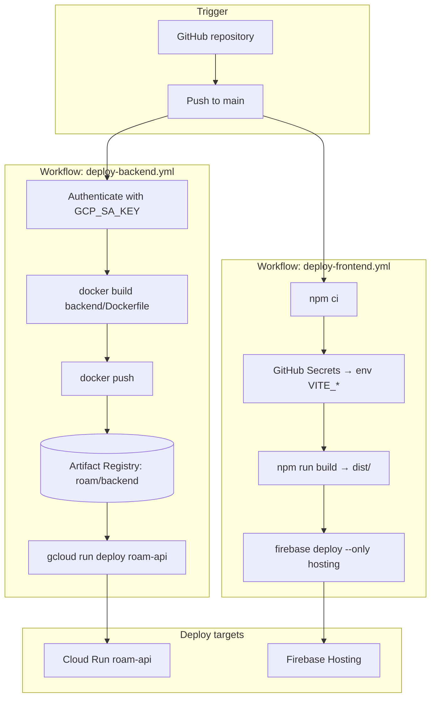

# Roam deployment (CI/CD)

How builds and deploys run in **GitHub Actions**: backend Docker image → **Artifact Registry** → **Cloud Run**, and frontend **Vite** build → **Firebase Hosting**. For **runtime architecture** (gateway, CUIT / Cloud Run policy, `X-Roam-Authorization`), see [ARCHITECTURE.md](ARCHITECTURE.md).

---

## Deployment diagram

Two workflows run on **push to `main`** (path-filtered). Both use **GitHub** as the source of truth; neither Hosting nor Cloud Run builds your code by themselves.

- **Backend:** The runner builds a **Docker image**, pushes it to **Artifact Registry** (`us-east1-docker.pkg.dev/.../roam/backend:<sha>`), then **deploys that image** to **Cloud Run** (`roam-api`).
- **Frontend:** The runner runs **Vite** with **`VITE_*` variables injected from GitHub Secrets**, then **`firebase deploy`** uploads **`dist/`** to **Firebase Hosting**.

---

## Frontend: Firebase Hosting and build-time configuration

The web app is deployed with **Firebase Hosting** from the `frontend/` directory (`firebase deploy --only hosting`, `public` = Vite `dist/`).

Hosting does **not** provide server-side environment variables or runtime injection for a static SPA. Values from `import.meta.env.VITE_*` are **compiled into the JavaScript bundle** when you run `npm run build`. There is no built-in “Hosting env” equivalent to Cloud Run’s env vars.

**Approach:** **GitHub Actions** supplies those values at **build time** by setting `env` on the build step from **GitHub Secrets** (dependency injection for the Vite build). The workflow is `.github/workflows/deploy-frontend.yml`.

Typical secrets (names must match what the workflow passes through):

- `VITE_API_BASE_URL` — public API Gateway base URL
- `VITE_FIREBASE_*` — Firebase web config (`apiKey`, `authDomain`, `projectId`, etc.)
- `VITE_ENVIRONMENT`, `VITE_GOOGLE_MAPS_API_KEY`, etc., as needed
- `FIREBASE_TOKEN`, `FIREBASE_PROJECT_ID` — for `firebase deploy`

**Important:** Changing a secret does nothing until the next workflow run rebuilds and redeploys; there is no redeploy-without-rebuild path for env changes.

---

## Backend: GitHub Actions, Artifact Registry, Cloud Run

On push to `main` that touches `backend/` or `.github/workflows/deploy-backend.yml`, `.github/workflows/deploy-backend.yml`:

1. Authenticates to GCP with **`GCP_SA_KEY`** (JSON key for a deploy service account).
2. Configures Docker for **Artifact Registry** in **`us-east1`**.
3. **Builds** the image from `backend/Dockerfile` (context `backend/`).
4. **Pushes** to `us-east1-docker.pkg.dev/<GCP_PROJECT_ID>/roam/backend:<git-sha>` and `:latest`.
5. **Deploys** to Cloud Run service **`roam-api`** in **`us-east1`** with that image.

Required secrets include **`GCP_SA_KEY`** and **`GCP_PROJECT_ID`**. Cloud Run **runtime** env vars and secrets (database, Firebase Admin, API keys) are **not** all defined in this file—they are set in the Cloud Run console (or extended in the workflow with `--set-env-vars` / `--set-secrets`). See `docs/ENV.md`.

### CI service account permissions

The account behind `GCP_SA_KEY` typically needs:

- **Artifact Registry Writer** — push images
- **Cloud Run Admin** — deploy `roam-api`
- **Service Account User** — if the Run service runs as another identity

### Artifact Registry

- **Repository:** `roam`, format **Docker**, region **`us-east1`** (aligned with Cloud Run and the workflow).
- **Image:** `roam/backend` — tags per commit SHA and `latest`.

The workflow creates images on push; you do not need to seed the image manually beyond creating the registry repository once.

### Org policy vs `--allow-unauthenticated`

The workflow may include `--allow-unauthenticated` on `gcloud run deploy`. **Columbia University IT (CUIT)** policy may require **IAM-only** invocation; if so, remove or avoid that flag and keep **API Gateway** as the public entry (see [ARCHITECTURE.md](ARCHITECTURE.md)).

---

## Summary

| Surface               | Mechanism            | Config / secrets                                                  |
| --------------------- | -------------------- | ----------------------------------------------------------------- |
| **Web static assets** | Firebase Hosting     | Build-time `VITE_*` via GitHub Secrets → Vite → `firebase deploy` |
| **API container**     | Cloud Run `roam-api` | Image from GHA → Artifact Registry; runtime env in Cloud Run      |
| **Public API URL**    | API Gateway          | OpenAPI + gateway SA with `run.invoker` on `roam-api`             |
