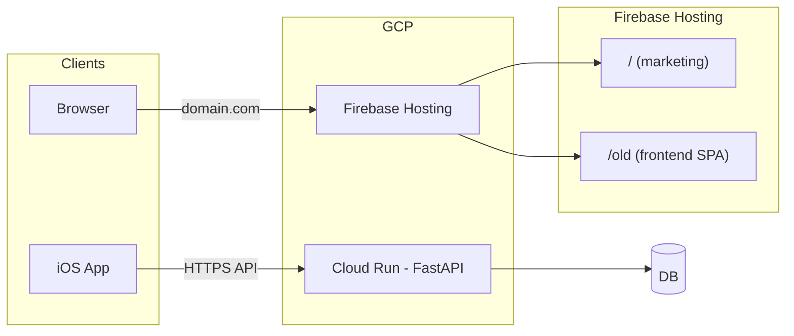

# Cloud Run, Marketing Site, and CI/CD Plan

## Current state

- **Backend:** FastAPI app in `backend/app/api/app.py`; routers under `/api`. Config in `backend/app/common/config.py` reads `DATABASE_URL`, `OPENAI_API_KEY`, Firebase vars, and `ENVIRONMENT`. App currently **raises if `ENVIRONMENT` is not `dev`** and CORS is dev-only.
- **Existing Docker:** `infra/Dockerfile` is for Postgres init (schema only), not the FastAPI service.
- **Frontend:** Vite + React in `frontend/`, with Marketing at `/` and app at `/app`; no Firebase Hosting config in repo yet.
- **No CI/CD:** No `.github/workflows` yet.

---

## 1. Backend: Cloud Run–ready FastAPI

### 1.1 Backend Dockerfile (use `backend/Dockerfile`)

- Add **`backend/Dockerfile`** (backend remains self-contained; do not use `infra/` for the FastAPI image).
- Use a Python slim image, `pip install -r requirements.txt`, copy backend app code, set `WORKDIR` so `app.api.app` resolves (e.g. copy into `/app` with `app/` at root, or set `PYTHONPATH`).
- Run: `uvicorn app.api.app:app --host 0.0.0.0 --port ${PORT:-8080}` so Cloud Run’s `PORT` is respected.
- Keep existing `infra/Dockerfile` for Postgres init only.

### 1.2 Allow production and CORS

- In `backend/app/api/app.py`: remove the `raise RuntimeError(...)` when `ENVIRONMENT != 'dev'`; in prod set `allowOrigins` from env (e.g. `FRONTEND_ORIGIN` or `CORS_ORIGINS`).
- Optionally restrict `/docs` and `/redoc` to dev only.

### 1.3 OpenAI and Google Maps: rely on existing API rate limit + provider limits

- **Existing API rate limiter:** The backend already has a per-user (and per-IP) HTTP rate limit in [backend/app/api/app.py](backend/app/api/app.py): 120 requests per 60 seconds (keyed by `uid` when authenticated). Each ingest is one `POST /api/ingest`, so a user can trigger at most 120 ingest jobs per minute. Each job does 1 OpenAI call and N Google Maps calls (N = number of extracted places). **No separate app-level rate limiters are required** for OpenAI or Maps; the general API rate limit already caps how many downstream calls each user can induce.
- **Provider-side limits (recommended):** Configure usage and rate limits in your provider dashboards so cost and abuse are capped at the source:
  - **OpenAI:** In the [OpenAI usage / billing settings](https://platform.openai.com/account/limits), set a monthly (or daily) spend limit and any rate limits your tier supports. If the limit is hit, the API will return errors (e.g. 429); the backend should handle these in [backend/app/services/processing.py](backend/app/services/processing.py) (e.g. mark job as failed with a clear message or retry with backoff).
  - **Google Maps (Places API):** In [Google Cloud Console](https://console.cloud.google.com/) → APIs & Services → quotas for the Places API, you can view and optionally lower request quotas (e.g. requests per minute per project). Set billing alerts so you’re notified before unexpected spend. Again, handle 429 or quota errors in processing (fail job or retry).
- **Code change:** Ensure processing handles provider throttling/errors gracefully (e.g. catch OpenAI and `httpx` errors in `_callVisionLLM` and `_resolveGoogleMaps`, set job status to `failed` with a clear `error` message when the provider returns rate limit or quota errors). No new rate-limit module is needed unless you later want per-operation caps (e.g. max LLM calls per user per hour) independent of HTTP request count.

### 1.4 Network and edge protections (anti-DDoS, WAF, bot filtering)

Cloud Run already gets **some** protection before traffic hits your app:

- **Built-in (no config):** Traffic to `*.run.app` goes through Google’s **Google Front End (GFE)**. GFE terminates TLS and applies **always-on DoS protections** at the edge (e.g. connection limits, absorption of certain floods). That helps with sudden load and basic abuse at the network/transport layer.
- **No built-in WAF or bot management:** Cloud Run does **not** include a Web Application Firewall (WAF), anti-bot, or application-layer DDoS (e.g. HTTP flood) filtering by default. Your app-level rate limiter and auth are the main application-layer controls.

To add **stronger** filtering and firewall-style protection in front of Cloud Run:

- **Put Cloud Run behind a load balancer and use Google Cloud Armor.** Armor attaches to an HTTP(S) load balancer (which uses a serverless NEG pointing at your Cloud Run service). Then you get:
  - **DDoS:** Standard and (with Armor Enterprise) advanced network DDoS mitigation; **Adaptive Protection** for L7 DDoS (e.g. HTTP floods) with ML-based detection and suggested rules.
  - **WAF:** Preconfigured rules for OWASP Top 10, XSS, SQLi, etc., and custom rules.
  - **Bot management:** reCAPTCHA integration (challenge or frictionless assessment), bot scoring, and actions (block, redirect, or add headers).
- **Trade-off:** You expose the API via the load balancer’s URL (and optionally a custom domain) instead of (or in addition to) the default `*.run.app` URL. The iOS app and any web clients would call that LB URL. Setup: create Global HTTP(S) LB → serverless NEG → Cloud Run service; create a Cloud Armor security policy and attach it to the LB backend; optionally add rate limiting, geo restrictions, or bot rules in that policy.

**Recommendation:** For MVP, especially when the main concern is **avoiding unexpectedly large bills**, the combination of **(1) GFE’s built-in DoS protection, (2) your in-app rate limiter, and (3) auth** is sufficient. If you later need stronger anti-bot or WAF, add **Cloud Run behind a load balancer + Cloud Armor** as an optional Phase 2 step.

### 1.5 Config and docs

- Document required/optional env vars (e.g. `docs/ENV.md`): `DATABASE_URL`, `OPENAI_API_KEY`, `ENVIRONMENT`, Firebase vars, `FRONTEND_ORIGIN`/`CORS_ORIGINS`, optional `GOOGLE_MAPS_API_KEY`.

---

## 2. CI/CD: GitHub Actions → Cloud Run

- Add `.github/workflows/deploy-backend.yml` on push to `main`: checkout, GCP auth (Workload Identity Federation or SA key in GitHub secret), build image from **`backend/Dockerfile`** (context: `backend/`), push to Artifact Registry (or GCR), deploy to Cloud Run with env vars and/or secrets (GitHub Secrets or GCP Secret Manager).
- Use **`backend/Dockerfile`** in the workflow (e.g. `docker build -f backend/Dockerfile backend/`).

---

## 3. Marketing website: copy Marketing.tsx + scaffolding

- **Source:** Use [frontend/src/pages/Marketing.tsx](frontend/src/pages/Marketing.tsx) as the base. It uses `Link` and `Button` only; copy it as-is and adapt.
- **New folder:** Create **`marketing/`** at repo root.
- **Scaffolding:**
  - **Vite + React + TypeScript** (same as frontend).
  - **Tailwind CSS** with the same theme tokens used in the frontend (copy `frontend/src/index.css` CSS variables / `@layer base` and `frontend/tailwind.config.ts` so the page looks identical).
  - **Minimal UI:** Copy the components the page needs: `Button` (and its dependencies: `@/components/ui/button`, `@/lib/utils`, `cn`). Replace `react-router-dom` `Link` with either:
    - Plain `<a href="...">` to the main app URLs (e.g. `https://app.yourdomain.com/login`) or
    - Keep React Router with a single route (e.g. `/` → Marketing page) and `Link` to `/login`, `/signup` (you can point base URL later via env).
  - **Single entry:** One main page component (the copied Marketing content); rename to something like `marketing/src/pages/Index.tsx` or keep as `Marketing.tsx` and import in `App.tsx` as the only route.
- **Branding:** The current copy says “Cozy Corner Dates”; treat this as the base to replace with Roam branding and new marketing content later.
- **Build output:** Configure Vite `build.outDir` (e.g. `dist/`) for Firebase Hosting to serve as the site root.

---

## 4. Firebase Hosting: marketing at root, optional `frontend` at `/old`

- Add **`firebase.json`** with a single `hosting` site: `public` directory = combined build (marketing build → `public/`, optional frontend build with `base: '/old/'` → `public/old/`).
- **Optional `/old`:** Build frontend with Vite `base: '/old/'`; add rewrite `"/old/**" → "/old/index.html"` for SPA routing; deploy step assembles `public/` and runs `firebase deploy --only hosting`.

---

## 5. High-level architecture

---

## 6. Implementation order (suggested)

1. **Backend:** Add `backend/Dockerfile`; update `app.py` for prod and CORS; ensure processing handles OpenAI/Maps errors (e.g. 429) gracefully; document env vars. Configure usage/rate limits in OpenAI and Google Cloud dashboards.
2. **CI/CD:** Add GitHub Actions workflow that builds from `backend/Dockerfile` and deploys to Cloud Run.
3. **Marketing:** Create `marketing/` with Vite+React+Tailwind, copy Marketing.tsx and minimal UI + theme, single route.
4. **Firebase:** Add `firebase.json`, combine marketing (and optional frontend) build, deploy hosting.

---

## 7. Files to add or change (summary)

| Area | Action |
|------|--------|
| Backend | Add **`backend/Dockerfile`** |
| Backend | Update `backend/app/api/app.py`: allow prod, CORS from env |
| Backend | Ensure `backend/app/services/processing.py` handles OpenAI/Maps 429 or quota errors (fail job with clear message). Rely on existing API rate limit + provider dashboard limits. |
| Docs | Add `docs/ENV.md` (or similar) |
| CI/CD | Add `.github/workflows/deploy-backend.yml` (build from `backend/Dockerfile`) |
| Marketing | Create `marketing/` with Vite+React+Tailwind, copy Marketing.tsx + Button + theme as base |
| Hosting | Add `firebase.json`; optional: build script and `/old` rewrites |
