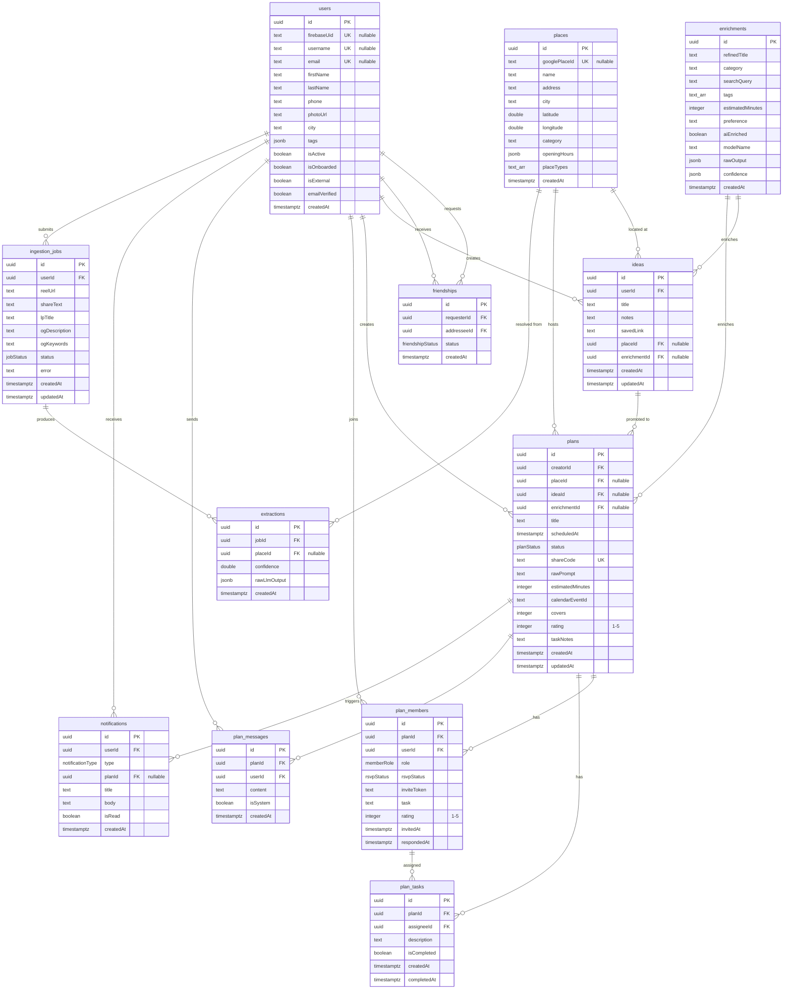

# Entity Relationship Diagram



## Enums

| Enum | Values | Used By |
|------|--------|---------|
| `jobStatus` | `processing`, `done`, `failed` | `ingestion_jobs.status` |
| `planStatus` | `draft`, `confirmed`, `completed`, `cancelled` | `plans.status` |
| `rsvpStatus` | `pending`, `accepted`, `declined` | `plan_members.rsvpStatus` |
| `memberRole` | `organizer`, `member` | `plan_members.role` |
| `friendshipStatus` | `pending`, `accepted` | `friendships.status` |
| `notificationType` | `invite_received`, `rsvp_accepted`, `rsvp_declined`, `task_assigned`, `plan_reminder`, `rate_prompt`, `friend_request` | `notifications.type` |

## Relationships

| From | To | Type | On Delete |
|------|----|------|-----------|
| `plans.creatorId` | `users.id` | many-to-one | CASCADE |
| `plans.placeId` | `places.id` | many-to-one (nullable) | SET NULL |
| `plans.ideaId` | `ideas.id` | many-to-one (nullable) | SET NULL |
| `plans.enrichmentId` | `enrichments.id` | many-to-one (nullable) | SET NULL |
| `ideas.userId` | `users.id` | many-to-one | CASCADE |
| `ideas.placeId` | `places.id` | many-to-one (nullable) | SET NULL |
| `ideas.enrichmentId` | `enrichments.id` | many-to-one (nullable) | SET NULL |
| `plan_members.planId` | `plans.id` | many-to-one | CASCADE |
| `plan_members.userId` | `users.id` | many-to-one | CASCADE |
| `plan_tasks.planId` | `plans.id` | many-to-one | CASCADE |
| `plan_tasks.assigneeId` | `plan_members.id` | many-to-one | CASCADE |
| `plan_messages.planId` | `plans.id` | many-to-one | CASCADE |
| `plan_messages.userId` | `users.id` | many-to-one | CASCADE |
| `friendships.requesterId` | `users.id` | many-to-one | CASCADE |
| `friendships.addresseeId` | `users.id` | many-to-one | CASCADE |
| `notifications.userId` | `users.id` | many-to-one | CASCADE |
| `notifications.planId` | `plans.id` | many-to-one (nullable) | CASCADE |
| `ingestion_jobs.userId` | `users.id` | many-to-one | CASCADE |
| `extractions.jobId` | `ingestion_jobs.id` | many-to-one | CASCADE |
| `extractions.placeId` | `places.id` | many-to-one (nullable) | SET NULL |

## Data Flow

```
Reel shared -> ingestion_job -> extraction -> place (created/matched)

User input -> idea (raw) -> enrichment (AI) -> place (resolved)
                                            -> idea card in UI
                         -> "Plan this" -> plan + plan_members
                                        -> shareCode -> /share/schedule?uid={shareCode}
                                        -> external user RSVP (auto-friend)
                                        -> calendar invite (GCal or SMS)
                                        -> notifications
```
