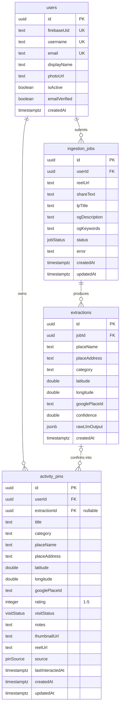

# Entity Relationship Diagram

## Enums

| Enum | Values |
|------|--------|
| `jobStatus` | `processing`, `done`, `failed` |
| `visitStatus` | `want`, `been` |
| `pinSource` | `reel`, `manual` |

## Relationships

| From | To | Type | On Delete |
|------|----|------|-----------|
| `ingestion_jobs.userId` | `users.id` | many-to-one | CASCADE |
| `extractions.jobId` | `ingestion_jobs.id` | many-to-one | CASCADE |
| `activity_pins.userId` | `users.id` | many-to-one | CASCADE |
| `activity_pins.extractionId` | `extractions.id` | many-to-one (nullable) | SET NULL |
