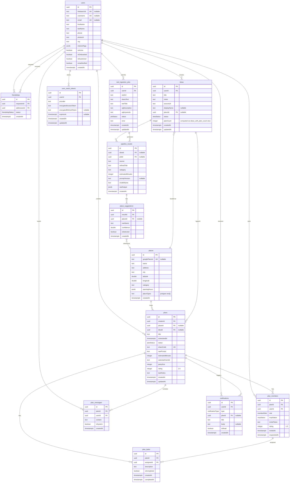

# Entity Relationship Diagram

Reflects `sql/schema.sql` (including `pipeline_results.promptVersion` and `user_oauth_tokens`).



## Enums

| Enum | Values | Used By |
|------|--------|---------|
| `ideaStatus` | `captured`, `suggesting`, `ready`, `planned` (deprecated) | `ideas.status` — ideas stay `ready` after promotion; `planned` never set |
| `jobStatus` | `processing`, `done`, `failed` | `reel_ingestion_jobs.status` |
| `planStatus` | `draft`, `confirmed`, `completed`, `cancelled` | `plans.status` |
| `rsvpStatus` | `pending`, `accepted`, `declined` | `plan_members.rsvpStatus` |
| `memberRole` | `organizer`, `member` | `plan_members.role` |
| `friendshipStatus` | `pending`, `accepted` | `friendships.status` |
| `notificationType` | `invite_received`, `rsvp_accepted`, `rsvp_declined`, `task_assigned`, `plan_reminder`, `rate_prompt`, `friend_request` | `notifications.type` |

## Relationships

| From | To | Type | On Delete |
|------|----|------|-----------|
| `plans.creatorId` | `users.id` | many-to-one | CASCADE |
| `plans.placeId` | `places.id` | many-to-one (nullable) | SET NULL |
| `plans.ideaId` | `ideas.id` | many-to-one (nullable) | SET NULL |
| `ideas.userId` | `users.id` | many-to-one | CASCADE |
| `ideas.placeId` | `places.id` | many-to-one (nullable) | SET NULL |
| `pipeline_results.ideaId` | `ideas.id` | many-to-one (nullable) | CASCADE |
| `pipeline_results.jobId` | `reel_ingestion_jobs.id` | many-to-one (nullable) | SET NULL |
| `place_suggestions.resultId` | `pipeline_results.id` | many-to-one | CASCADE |
| `place_suggestions.placeId` | `places.id` | many-to-one (nullable) | SET NULL |
| `plan_members.planId` | `plans.id` | many-to-one | CASCADE |
| `plan_members.userId` | `users.id` | many-to-one | CASCADE |
| `plan_tasks.planId` | `plans.id` | many-to-one | CASCADE |
| `plan_tasks.assigneeId` | `plan_members.id` | many-to-one | CASCADE |
| `plan_messages.planId` | `plans.id` | many-to-one | CASCADE |
| `plan_messages.userId` | `users.id` | many-to-one | CASCADE |
| `friendships.requesterId` | `users.id` | many-to-one | CASCADE |
| `friendships.addresseeId` | `users.id` | many-to-one | CASCADE |
| `notifications.userId` | `users.id` | many-to-one | CASCADE |
| `notifications.planId` | `plans.id` | many-to-one (nullable) | CASCADE |
| `reel_ingestion_jobs.userId` | `users.id` | many-to-one | CASCADE |
| `user_oauth_tokens.userId` | `users.id` | many-to-one | CASCADE |

### Unique constraints (indexes)

| Table | Constraint |
|-------|------------|
| `user_oauth_tokens` | `UNIQUE ("userId", "provider")` |
| `friendships` | `UNIQUE` on `(LEAST(requesterId, addresseeId), GREATEST(requesterId, addresseeId))` (one row per unordered pair) |
| `reel_ingestion_jobs` | `UNIQUE ("userId", "reelUrl")` |

### Check constraints

| Table | Rule |
|-------|------|
| `pipeline_results` | `reel_result_has_idea`: if `jobId` is set, `ideaId` must be set (`jobId IS NULL OR ideaId IS NOT NULL`) |
| `friendships` | `requesterId <> addresseeId` |
| `plans` / `plan_members` | `rating` in 1–5 when present (see schema `CHECK`) |

## Views

| View | Definition | Purpose |
|------|------------|---------|
| `ideas_with_plan_count` | `ideas` LEFT JOIN `plans` GROUP BY `ideas.id` | Adds computed `planCount` for each idea; used by API when listing ideas |

## Data Flow

```
Reel shared -> reel_ingestion_job -> idea (captured) -> suggesting -> pipeline_result + place_suggestions -> ready
                                                                    -> places (created/matched)

User input -> idea (raw) -> suggesting -> pipeline_result + place_suggestions -> ready
                                                          -> place (resolved)
                                                          -> idea card in UI
                         -> "Plan this" -> plan + plan_members (idea stays ready, reusable)
                                        -> shareCode -> /share/schedule?uid={shareCode}
                                        -> external user RSVP (auto-friend)
                                        -> calendar invite (GCal or SMS)
                                        -> notifications
```
