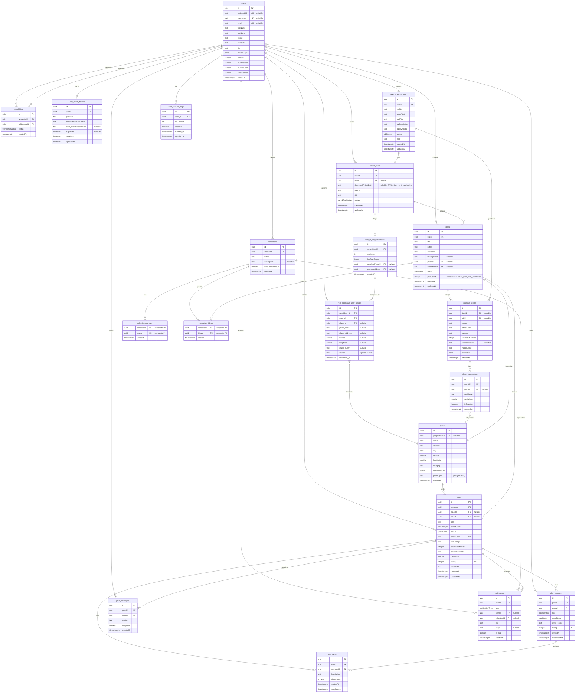

# Entity Relationship Diagram

Reflects `sql/schema.sql` (including `pipeline_results.promptVersion` and `user_oauth_tokens`). **Reel thumbnail images** are not rows or BLOBs in Postgres: the DB stores an **object key** on `saved_reels.thumbnailObjectPath` pointing at a file in **Google Cloud Storage** (see [ARCHITECTURE.md](ARCHITECTURE.md) and [ENV.md](ENV.md)). For **request/infrastructure** flow, see [ARCHITECTURE.md](ARCHITECTURE.md). For **HTTP JSON types** generated from FastAPI, see [OPENAPI.md](OPENAPI.md).



## Enums

| Enum | Values | Used By |
|------|--------|---------|
| `ideaStatus` | `captured`, `suggesting`, `ready`, `planned` (deprecated) | `ideas.status` — ideas stay `ready` after promotion; `planned` never set |
| `jobStatus` | `processing`, `done`, `failed` | `reel_ingestion_jobs.status` |
| `savedReelStatus` | `processing`, `needs_review`, `promoted`, `failed` | `saved_reels.status` |
| `planStatus` | `draft`, `confirmed`, `completed`, `cancelled` | `plans.status` |
| `rsvpStatus` | `pending`, `accepted`, `declined` | `plan_members.rsvpStatus` |
| `memberRole` | `organizer`, `member` | `plan_members.role` |
| `friendshipStatus` | `pending`, `accepted` | `friendships.status` |
| `notificationType` | `invite_received`, `rsvp_accepted`, `rsvp_declined`, `task_assigned`, `plan_reminder`, `rate_prompt`, `friend_request`, `added_to_collection` | `notifications.type` |

## Relationships

| From | To | Type | On Delete |
|------|----|------|-----------|
| `plans.creatorId` | `users.id` | many-to-one | CASCADE |
| `plans.placeId` | `places.id` | many-to-one (nullable) | SET NULL |
| `plans.ideaId` | `ideas.id` | many-to-one (nullable) | SET NULL |
| `ideas.userId` | `users.id` | many-to-one | CASCADE |
| `ideas.placeId` | `places.id` | many-to-one (nullable) | SET NULL |
| `ideas.savedReelId` | `saved_reels.id` | many-to-one (nullable) | SET NULL |
| `pipeline_results.ideaId` | `ideas.id` | many-to-one (nullable) | CASCADE |
| `pipeline_results.jobId` | `reel_ingestion_jobs.id` | many-to-one (nullable) | SET NULL |
| `place_suggestions.resultId` | `pipeline_results.id` | many-to-one | CASCADE |
| `place_suggestions.placeId` | `places.id` | many-to-one (nullable) | SET NULL |
| `plan_members.planId` | `plans.id` | many-to-one | CASCADE |
| `plan_members.userId` | `users.id` | many-to-one | CASCADE |
| `plan_tasks.planId` | `plans.id` | many-to-one | CASCADE |
| `plan_tasks.assigneeId` | `plan_members.id` | many-to-one | CASCADE |
| `plan_messages.planId` | `plans.id` | many-to-one | CASCADE |
| `plan_messages.userId` | `users.id` | many-to-one | CASCADE |
| `friendships.requesterId` | `users.id` | many-to-one | CASCADE |
| `friendships.addresseeId` | `users.id` | many-to-one | CASCADE |
| `notifications.userId` | `users.id` | many-to-one | CASCADE |
| `notifications.planId` | `plans.id` | many-to-one (nullable) | CASCADE |
| `notifications.collectionId` | `collections.id` | many-to-one (nullable) | SET NULL |
| `collections.creatorId` | `users.id` | many-to-one | CASCADE |
| `collection_members.collectionId` | `collections.id` | many-to-one | CASCADE |
| `collection_members.userId` | `users.id` | many-to-one | CASCADE |
| `collection_ideas.collectionId` | `collections.id` | many-to-one | CASCADE |
| `collection_ideas.ideaId` | `ideas.id` | many-to-one | CASCADE |
| `reel_ingestion_jobs.userId` | `users.id` | many-to-one | CASCADE |
| `saved_reels.userId` | `users.id` | many-to-one | CASCADE |
| `saved_reels.jobId` | `reel_ingestion_jobs.id` | one-to-one | CASCADE |
| `reel_ingest_candidates.savedReelId` | `saved_reels.id` | many-to-one | CASCADE |
| `reel_ingest_candidates.resolvedPlaceId` | `places.id` | many-to-one (nullable) | SET NULL |
| `reel_ingest_candidates.promotedIdeaId` | `ideas.id` | many-to-one (nullable) | SET NULL |
| `reel_candidate_user_places.candidate_id` | `reel_ingest_candidates.id` | many-to-one | CASCADE |
| `reel_candidate_user_places.user_id` | `users.id` | many-to-one | CASCADE |
| `reel_candidate_user_places.place_id` | `places.id` | many-to-one (nullable) | SET NULL |
| `user_feature_flags.user_id` | `users.id` | many-to-one | CASCADE |
| `user_oauth_tokens.userId` | `users.id` | many-to-one | CASCADE |

### Saved reels & staged candidates (design)

- **`saved_reels.thumbnailObjectPath`** — When [GCS is configured](ENV.md), this column holds the **object key** inside **`GCS_REEL_BUCKET_NAME`** (e.g. `reels/{userId}/{jobId}/thumb.jpg`). There is **no SQL foreign key** to the bucket; consistency is enforced by the API at upload time. The API returns **signed URLs** derived from this path; clients never need the raw bucket name if they only use API fields.
- **`ideas.savedReelId`** — Optional link from an **idea** back to the **saved reel** it came from (promotion, auto-ingest, or manual “add idea on reel”). User-edited titles, notes, and `placeId` live on the idea; **`reel_ingest_candidates`** stay as the immutable LLM snapshot.
- **`reel_ingest_candidates.sortIndex`** — Ordering among candidates for a reel: **highest model confidence first** (`0` = top). Synthetic “no candidates above threshold” rows use a single row at `0`.
- **`reel_ingest_candidates.savedReelId`** — Candidates are tied to the **user-facing saved reel** (the grid tile), not directly to `reel_ingestion_jobs`. The job remains on `saved_reels.jobId` for the worker and `pipeline_results.jobId`.
- **`reel_ingest_candidates.llmRawOutput`** — JSON from the vision step: e.g. `candidate`, `fullStructured`, `metadata`, and flags like `synthetic` / `branch` — the raw input for user review and promote.

### Unique constraints (indexes)

| Table | Constraint |
|-------|------------|
| `user_oauth_tokens` | `UNIQUE ("userId", "provider")` |
| `friendships` | `UNIQUE` on `(LEAST(requesterId, addresseeId), GREATEST(requesterId, addresseeId))` (one row per unordered pair) |
| `reel_ingestion_jobs` | `UNIQUE ("userId", "reelUrl")` |
| `reel_candidate_user_places` | `UNIQUE ("candidate_id", "user_id")` |
| `user_feature_flags` | `UNIQUE ("user_id", "flag_name")` |
| `collections` | **Partial unique:** at most one row per `creatorId` where `isPersonalDefault` (see `sql/schema.sql`) |
| `collection_members` | `PRIMARY KEY ("collectionId", "userId")` |
| `collection_ideas` | `PRIMARY KEY ("collectionId", "ideaId")` |

### Check constraints

| Table | Rule |
|-------|------|
| `pipeline_results` | `reel_result_has_idea`: if `jobId` is set, `ideaId` must be set (`jobId IS NULL OR ideaId IS NOT NULL`) |
| `friendships` | `requesterId <> addresseeId` |
| `reel_candidate_user_places` | `source IN ('pipeline', 'user')` |
| `plans` / `plan_members` | `rating` in 1–5 when present (see schema `CHECK`) |

## Views

| View | Definition | Purpose |
|------|------------|---------|
| `ideas_with_plan_count` | `ideas` LEFT JOIN `plans` GROUP BY `ideas.id` | Adds computed `planCount` for each idea; used by API when listing ideas |

## Data Flow

```
Reel shared -> reel_ingestion_job -> (vision) -> saved_reel row
              -> optional: thumbnail -> GCS; path -> saved_reels.thumbnailObjectPath
              -> N ideas (one per candidate) -> each: pipeline_result + place_suggestions -> ready
              -> places (created/matched)

User input -> idea (raw) -> suggesting -> pipeline_result + place_suggestions -> ready
                                                          -> place (resolved)
                                                          -> idea card in UI
                         -> "Plan this" -> plan + plan_members (idea stays ready, reusable)
                                        -> shareCode -> /share/schedule?uid={shareCode}
                                        -> external user RSVP (auto-friend)
                                        -> calendar invite (GCal or SMS)
                                        -> notifications
```
